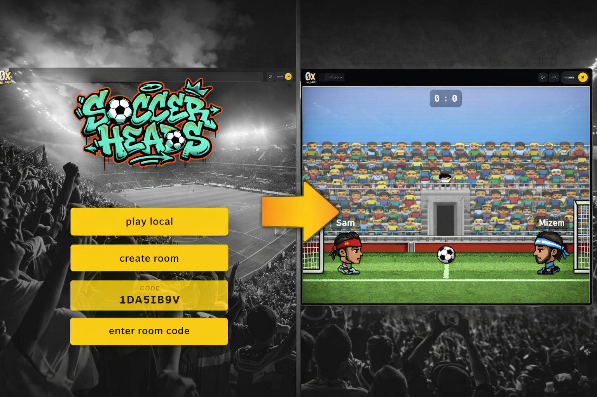
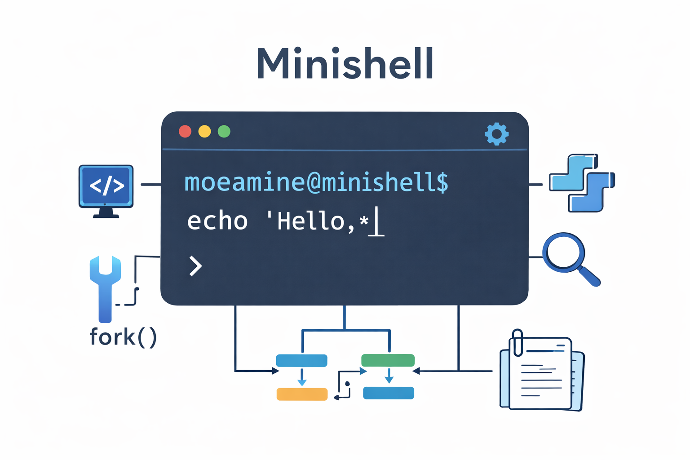
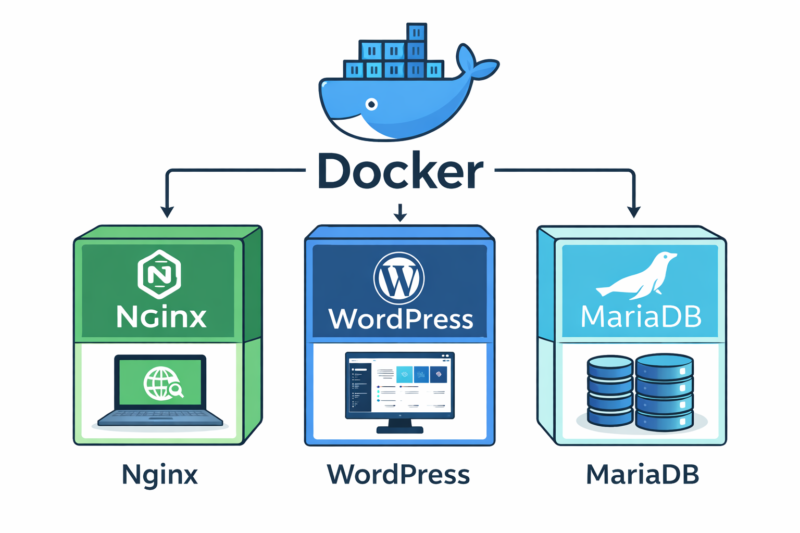

<!-- Hero Section -->
<section class="hero">
  

    

      <h1 class="hero-title">Mohammed Amine Izem</h1>
      
Software Engineering Student @1337 | Full Stack & Real-time Systems Developer

      

        

          3
          Major Projects
        

        

          42
          Network Graduate
        

        

          100%
          Passion for Code
        

      

      

        <a href="#projects" class="btn btn-primary">View My Work</a>
        <a href="#contact" class="btn btn-secondary">Get In Touch</a>
      

    

    

      
    

  

</section>

<!-- Skills Section -->
<section class="skills">
  

    <h2 class="section-title">Tech Stack</h2>
    

      

        <h3>💻 Languages</h3>
        

          C
          C++
          TypeScript
          JavaScript
        

      

      

        <h3>⚙️ Backend</h3>
        

          Node.js
          NestJS
          Express
          Socket.io
        

      

      

        <h3>🎨 Frontend</h3>
        

          React
          Next.js
          TailwindCSS
        

      

      

        <h3>🚀 DevOps</h3>
        

          Docker
          Nginx
          Linux
        

      

    

  

</section>

<!-- Projects Section -->
<section class="projects" id="projects">
  

    <h2 class="section-title">Featured Projects</h2>
    

      <!-- Project 1 -->
      

        

          
        

        

          <h3>ft_transcendence</h3>
          
Real-Time Multiplayer Soccer Game

          

            A real-time multiplayer soccer game website built with modern full-stack technologies. 
            Engineered the core real-time infrastructure with server-side physics engine and collision detection.
          

          

            NestJS
            React
            Socket.io
            TypeScript
          

          

            Real-time multiplayer gameplay
            Physics engine
            Live state synchronization
          

        

      

      <!-- Project 2 -->
      

        

          
        

        

          <h3>Minishell</h3>
          
Custom Bash-Like Shell

          

            A Unix shell written in C that replicates many behaviors of Bash. 
            Demonstrates deep understanding of Unix internals and system calls.
          

          

            C
            Unix
            System Calls
          

          

            Process creation
            Pipes and redirections
            Signal handling
          

        

      

      <!-- Project 3 -->
      

        

          
        

        

          <h3>Inception</h3>
          
Docker Infrastructure Project

          

            Complete containerized infrastructure built with Docker. 
            Real-world DevOps skills with service orchestration and reverse proxy configuration.
          

          

            Docker
            Nginx
            WordPress
            MariaDB
          

          

            Service orchestration
            Reverse proxy
            Production-ready
          

        

      

    

  

</section>

<!-- About Section -->
<section class="about">
  

    <h2 class="section-title">About Me</h2>
    

      

        

          I'm a developer from <strong>Morocco</strong> focused on building <strong>functional, high-performance applications</strong>.
          My journey at <strong>1337 / 42 Network</strong> has trained me to solve complex problems, understand systems deeply, 
          and write <strong>clean, maintainable code</strong>.
        

        

          

            🎓
            Software Engineering Student at 1337
          

          

            🌍
            Based in Tetouan, Morocco
          

          

            🧠
            Passionate about systems programming
          

          

            ⚙️
            Experienced with OS-level programming
          

        

      

      

        <h3>What I Focus On</h3>
        <ul class="focus-list">
          <li>Systems Programming</li>
          <li>Backend Architecture</li>
          <li>Real-Time Applications</li>
          <li>Performance Optimization</li>
          <li>Clean Code & Maintainability</li>
        </ul>
      

    

  

</section>

<!-- Contact Section -->
<section class="contact" id="contact">
  

    <h2 class="section-title">Get In Touch</h2>
    

      

        

          📧
          

            <h4>Email</h4>
            
amineshady6@gmail.com

          

        

        

          📍
          

            <h4>Location</h4>
            
Tetouan, Morocco

          

        

        

          💼
          

            <h4>LinkedIn</h4>
            
<a href="https://linkedin.com/in/moe-amine-izem-199044266" target="_blank">Connect with me</a>

          

        

      

      

        
Interested in working together? Let's connect and discuss how I can contribute to your projects!

        

          <a href="https://github.com/Mizemm" target="_blank" class="social-btn">GitHub Profile</a>
          <a href="https://linkedin.com/in/moe-amine-izem-199044266" target="_blank" class="social-btn">LinkedIn</a>
        

      

    

  

</section>